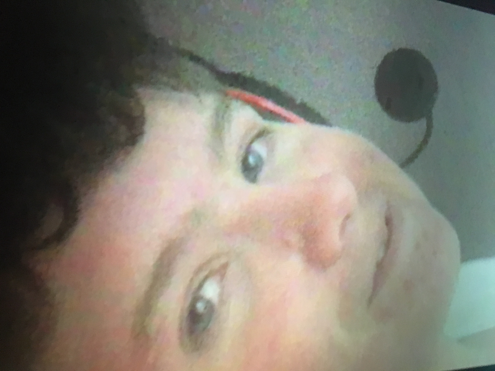

# Lossy Compression
#### JPEG Image
1. To start this method works with images only. Once you have your image opened you can mouse over to the file tab.
2. Next find where it says "Save as"
3. A new window should pop up asking you for a destination for your new image file, however before you change anything under the format drop down and select the "JPEG" format.
4. You've completed the Lossy Compression method via JPEG, if you really want to see the effects of Lossy JPEG take that same JPG file you just created and re open it and save it again as another JPG file.
5. If you manage to do this you might notice a slight loss in file size and or quality of image between each save of JPG.
### Example
First JPG                  |  After Compressing For Awhile
:-------------------------:|:-------------------------:
 |  

[Back](README.md)
